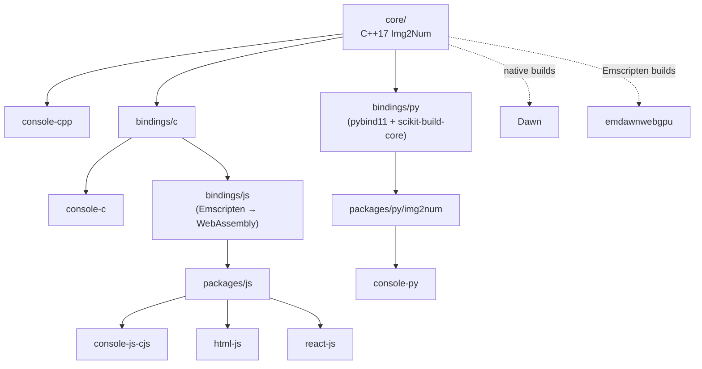

# Architecture Overview

Img2Num is built around a native C++17 core. On top of that core sit language bindings, packages you can install, and example apps. This page shows how those parts connect, so you can quickly find the part of the repo an issue is about.

## Architecture

## How the pieces fit together

**Core (`core/`)**: the native C++17 `Img2Num` library. All the image processing lives here. For GPU work, native builds use Dawn, while Emscripten builds compile the core with the `emdawnwebgpu` port instead. The two are never used at the same time (see `core/CMakeLists.txt`).

**C bindings (`bindings/c`)**: a C-compatible interface over the core. The C example (`console-c`) uses it directly, and the JS bindings are built on top of it.

**JavaScript bindings (`bindings/js`)**: these link against the C bindings (`CImg2Num` in `bindings/js/CMakeLists.txt`), not against the core directly. Emscripten compiles everything to WebAssembly, and the JS code calls into the wasm through the C API using `ccall` / `cwrap`. The result is packaged in `packages/js` and used by the JS examples (`console-js-cjs`, `html-js`, `react-js`).

**Python bindings (`bindings/py`)**: the C++ core is exposed to Python with pybind11 and built with scikit-build-core. The built module gets installed into `packages/py/img2num/`, and `console-py` uses it.

**C++ example (`console-cpp`)**: uses the core library directly, without any bindings.

## Where to start

Not sure where to look? Match your issue to a directory:

| If the issue is about...                               | Look in                          |
| ------------------------------------------------------ | -------------------------------- |
| Image algorithms, performance, GPU code                | `core/`                          |
| The C API / C interface                                | `bindings/c/`                    |
| The JS/wasm build, `ccall` / `cwrap`, Emscripten       | `bindings/js/`, `packages/js/`   |
| The Python module, pybind11, Python packaging          | `bindings/py/`, `packages/py/`   |
| A bug or change in a demo app                          | the matching example directory   |

## Related docs

- [Internal docs home](../internal/index.md)
- Core: [C++ Core Overview](../internal/core/index.md), [C++ API Reference](../internal/core/api-reference.md)
- C bindings: [Img2Num C Bindings](../internal/bindings/c/index.md), [C API Reference](../internal/bindings/c/api-reference.md)
- JS bindings: [Img2Num JS/WASM Bindings](../internal/bindings/js/index.md), [JS/WASM API Reference](../internal/bindings/js/api-reference.md)
- Python bindings: [Img2Num Python Bindings](../internal/bindings/py/index.md), [Python API Reference](../internal/bindings/py/api-reference.md)
- Packages: [Packages](../internal/packages/index.md), [WASM Worker for Image Module](../internal/packages/js/index.md)
- Example apps: [C & C++ Example Apps](../internal/example-apps/console-c-and-console-cpp/index.md), [React Overview](../internal/example-apps/react-js/index.md)
- Scripts and CI: [Development Scripts](../internal/scripts/index.md), [GitHub Workflows](../internal/dot-github/workflows/index.md)